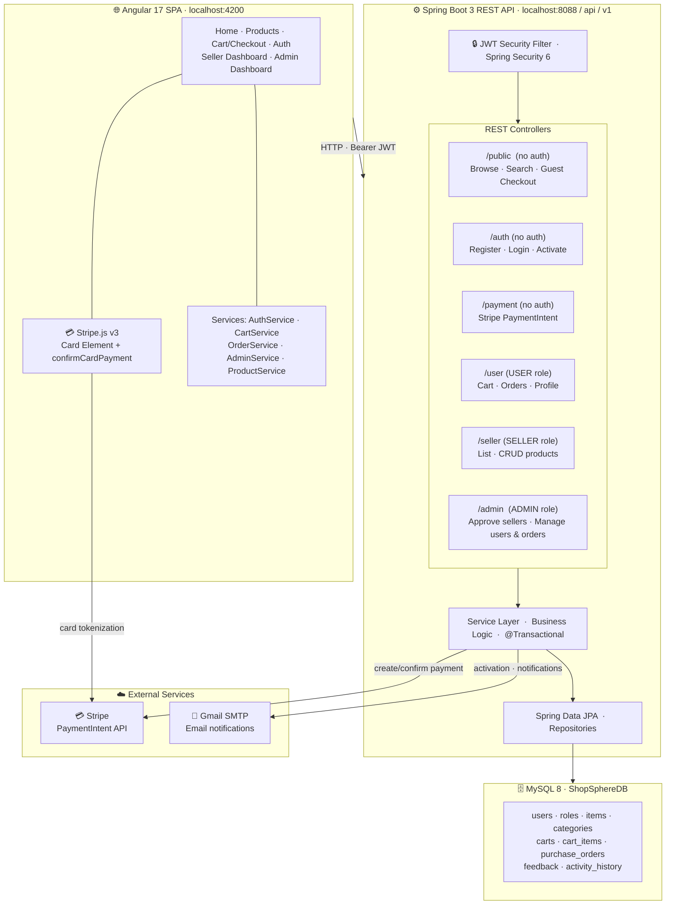

# ShopSphere 🛒

> A production-grade multi-seller e-commerce platform built with **Spring Boot 3**, **Angular 17**, **JWT**, **Stripe**, and **Gmail SMTP**.

[](https://openjdk.org/)
[](https://spring.io/projects/spring-boot)
[](https://angular.io/)
[](https://www.mysql.com/)
[](https://stripe.com/)
[](LICENSE)

---

## Overview

**ShopSphere** is a full-stack marketplace where:
- 🛍️ **Buyers** discover and purchase products — no account required
- 🏪 **Sellers** apply, get admin-approved, and manage their storefronts
- 🛡️ **Admins** oversee the platform, approve sellers, and manage orders
- 💳 Every checkout is secured through **Stripe PaymentIntent**
- 📧 Email notifications sent via **Gmail SMTP**

---

## Architecture



---

## Features

| Feature | Details |
|---------|---------|
| **Guest Shopping** | Browse, add to cart, and checkout without an account |
| **Stripe Checkout** | Full PaymentIntent flow with Stripe Card Element — no card data touches the backend |
| **Authentication** | JWT access + refresh tokens, email activation |
| **Seller Approval** | Sellers register → email activation → Admin approves before access |
| **Role-based access** | `USER` · `SELLER` · `ADMIN` with method-level security |
| **Product management** | CRUD listings with 18 categories, search & price filter |
| **Shopping cart** | Guest cart (localStorage) + authenticated cart (API), merged on login |
| **Orders** | Place orders, track delivery status (PENDING → CONFIRMED → SHIPPED → DELIVERED) |
| **Reviews** | Star ratings and comments per product |
| **Admin dashboard** | Approve/reject sellers, view users & orders, platform stats |
| **Email notifications** | Gmail SMTP — activation emails and order confirmations |
| **Pagination** | All list endpoints paginated with sorting & filtering |
| **API Docs** | Interactive Swagger UI (OpenAPI 3) |
| **Demo data** | 24 products, 18 categories, 3 test accounts — seeded at first startup |

---

## Tech Stack

### Backend
- **Java 17** · **Spring Boot 3.3.2**
- **Spring Security 6** · JWT (JJWT 0.11) — stateless
- **Spring Data JPA** · Hibernate · **MySQL 8**
- **Stripe Java SDK** — PaymentIntent creation & confirmation
- **Spring Mail** → **Gmail SMTP** — transactional emails
- **SpringDoc OpenAPI** — Swagger UI
- **Lombok** · Jackson

### Frontend
- **Angular 17** (Standalone Components, lazy-loaded routes)
- **Angular Signals** — reactive state management (no NgRx)
- **Tailwind CSS v3** — utility-first styling
- **Stripe.js v3** — Card Element (PCI-compliant card capture)
- **RxJS** · Angular HttpClient

---

## Getting Started

### Prerequisites
- Java 17+ · Maven
- Node.js 18+ · npm
- MySQL 8 running on port `3307`
- Stripe account (test mode is free)
- Gmail account with App Password

### 1. Configure environment

```bash
git clone https://github.com/yosr-fourati/ShopSphere.git
cd TunisiCart
cp .env.example .env
```

Edit `.env`:

```properties
# MySQL
DB_URL=jdbc:mysql://localhost:3307/ShopSphereDB
DB_USERNAME=your_username
DB_PASSWORD=your_password

# Gmail SMTP  →  see Gmail Setup section below
MAIL_USERNAME=shopsphere.notify@gmail.com
MAIL_PASSWORD=xxxx xxxx xxxx xxxx   # 16-char App Password

# Stripe  →  https://dashboard.stripe.com/apikeys
STRIPE_SECRET_KEY=sk_test_...
STRIPE_PUBLISHABLE_KEY=pk_test_...

# JWT (any 32+ char secret)
JWT_SECRET=your_hex_secret_here
```

### 2. Start backend

```bash
./mvnw spring-boot:run
```

- **API:** `http://localhost:8088/api/v1`
- **Swagger UI:** `http://localhost:8088/api/v1/swagger-ui.html`

> Database seeded automatically on first run. Admin account always recreated on every startup.

### 3. Add Stripe publishable key to Angular

Edit `shopsphere-frontend/src/environments/environment.ts`:
```typescript
export const environment = {
  production: false,
  apiUrl: 'http://localhost:8088/api/v1',
  stripePublishableKey: 'pk_test_YOUR_KEY_HERE',
};
```

### 4. Start frontend

```bash
cd shopsphere-frontend
npm install
ng serve
```

App runs at **http://localhost:4200**

---

## Default Accounts

| Role | Email | Password | Notes |
|------|-------|----------|-------|
| 🛡️ **Admin** | `admin@shopsphere.com` | `Admin1234!` | Always re-seeded on startup |
| 🏪 **Seller** | `seller@shopsphere.com` | `Seller1234!` | Demo only (first run) |
| 🛒 **Buyer** | `buyer@shopsphere.com` | `Buyer1234!` | Demo only (first run) |

---

## Stripe Test Cards

| Scenario | Card Number |
|----------|------------|
| ✅ Payment succeeds | `4242 4242 4242 4242` |
| ❌ Card declined | `4000 0000 0000 0002` |
| 🔐 3D Secure required | `4000 0025 0000 3155` |

Any future expiry date · any 3-digit CVC · any postal code.

---

## Checkout Flows

### Guest Checkout (no account needed)
```
Browse products
  → Add to cart  (stored in localStorage)
  → Cart page → "Proceed to Checkout"
  → Fill: name, email, delivery address
  → "Continue to Payment"
  → Stripe Card Element appears
  → Enter test card  (4242 4242 4242 4242)
  → "Pay $XX.XX"
  → ✅ Order confirmed — confirmation email sent
```

### Authenticated Checkout
```
Login → Browse → Add to cart (API cart)
  → Cart page → "Place Order"
  → Stripe Card Element appears
  → Enter card → "Pay $XX.XX"
  → ✅ Order saved + visible in Order History
```

---

## API Reference

```
PUBLIC (no auth)
  GET  /public/items                    List / search / filter products
  GET  /public/items/{id}               Product detail
  GET  /public/categories               All 18 categories
  GET  /public/sellers                  Verified sellers
  POST /public/orders                   Guest checkout order

AUTH (no auth)
  POST /auth/register                   Register (role: USER or SELLER)
  POST /auth/authenticate               Login → JWT tokens
  GET  /auth/activate-account?token=    Email activation

PAYMENT (no auth)
  POST /payment/create-payment-intent   Create Stripe PaymentIntent → clientSecret

USER (JWT Bearer, role USER)
  GET    /user/cart/{userId}            Get cart
  POST   /user/cart/{userId}/items      Add item
  PUT    /user/cart/{cartItemId}        Update quantity
  DELETE /user/cart/{cartItemId}        Remove item
  POST   /user/orders                   Place authenticated order
  GET    /user/orders/history/{userId}  Order history

SELLER (JWT Bearer, role SELLER)
  GET    /seller/items                  My listings
  POST   /seller/items                  Create listing
  PUT    /seller/items/{id}             Update listing
  DELETE /seller/items/{id}             Delete listing
  GET    /seller/orders                 Orders with my products

ADMIN (JWT Bearer, role ADMIN)
  GET    /admin/users                   All users
  DELETE /admin/users/{id}              Remove user
  GET    /admin/sellers/pending         Sellers awaiting approval
  PUT    /admin/sellers/{id}/approve    Approve seller
  PUT    /admin/sellers/{id}/reject     Reject seller
  GET    /admin/orders                  All orders
  PUT    /admin/orders/{id}             Update order status
  DELETE /admin/orders/{id}             Delete order
```

---

## Gmail SMTP Setup

1. Create a Gmail account: e.g. `shopsphere.notify@gmail.com`
2. Go to **Google Account** → **Security** → Enable **2-Step Verification**
3. Go to **Security** → **App Passwords** → Generate for *Mail / Other*
4. Copy the 16-character password (remove spaces) → paste in `.env` as `MAIL_PASSWORD`
5. Restart backend — email activation and order confirmations will work

---

## Project Structure

```
TunisiCart/
├── src/main/java/com/AeiselDev/ShopSphere/
│   ├── Configs/          DataSeeder, OpenAPI config, CORS
│   ├── controllers/      REST endpoints (Auth, Public, User, Seller, Admin, Payment)
│   ├── services/         Business logic
│   ├── entities/         JPA entities (User, Item, PurchaseOrder, Cart…)
│   ├── repositories/     Spring Data repositories
│   ├── security/         JWT filter, SecurityConfig
│   ├── enums/            RoleType, DeliveryStatus
│   └── common/           Request/Response DTOs
├── src/main/resources/
│   └── application.yml   App config (DB, Gmail SMTP, JWT, Stripe)
├── .env                  Local secrets — never commit!
└── .env.example          Template for developers

shopsphere-frontend/
└── src/app/
    ├── core/
    │   ├── models/       TypeScript interfaces
    │   ├── services/     HTTP services (auth, cart, order, admin, product)
    │   ├── guards/       Route guards (authGuard, sellerGuard, adminGuard, guestGuard)
    │   └── utils/        Product image helpers
    ├── features/
    │   ├── home/         Landing page with featured products
    │   ├── products/     Product list (filter/search) + detail
    │   ├── cart/         Cart + multi-step Stripe checkout
    │   ├── orders/       Order history
    │   ├── auth/         Login, Register (buyer/seller toggle), Activate
    │   ├── seller/       Seller dashboard (CRUD products)
    │   └── admin/        Admin dashboard (pending sellers, users, orders)
    └── shared/components  Navbar with role-based links
```

---

## Author

**Yosr Fourati** — MS Software Engineering · Oakland University · 2026
[GitHub](https://github.com/yosr-fourati)

---

## License

MIT © 2024–2026 Yosr Fourati
