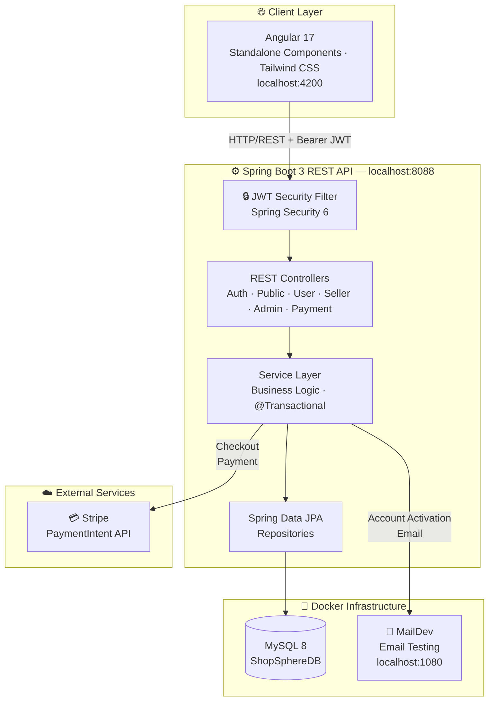

# ShopSphere 🛒

> A production-grade multi-seller e-commerce platform built with **Spring Boot 3**, **Angular 17**, **JWT**, and **Stripe**.

[](https://openjdk.org/)
[](https://spring.io/projects/spring-boot)
[](https://angular.io/)
[](https://www.mysql.com/)
[](https://stripe.com/)
[](https://www.docker.com/)
[](LICENSE)

---

## Overview

**ShopSphere** is a full-stack marketplace where buyers discover and purchase products, sellers manage their storefronts, and admins oversee the entire platform.

Built with clean architecture, JWT security, and modern DevOps practices.

---

## Architecture



---

## Features

| Feature | Details |
|---|---|
| **Authentication** | JWT + refresh tokens, email activation flow |
| **Role-based access** | `USER` · `SELLER` · `ADMIN` with method-level security |
| **Product management** | CRUD listings with categories and image upload |
| **Shopping cart** | Add / update / remove items, persistent per user |
| **Orders** | Place orders, track delivery status |
| **Payments** | Stripe PaymentIntent integration |
| **Reviews** | Star ratings and comments per product |
| **Pagination** | All list endpoints paginated (default 20/page) |
| **Activity tracking** | View and purchase history per user |
| **Admin dashboard** | User, role, and item management + system stats |
| **API Docs** | Interactive Swagger UI (OpenAPI 3) |
| **Demo data** | Auto-seeded on first startup — 24 products, 8 categories, 3 test users |

---

## Tech Stack

**Backend**
- Java 17 · Spring Boot 3.3.2
- Spring Security 6 · JWT (JJWT 0.11)
- Spring Data JPA · Hibernate · MySQL 8
- Stripe Java SDK 26
- SpringDoc OpenAPI (Swagger UI)
- Spring Batch · Spring Modulith
- Lombok · Docker Compose

**Frontend**
- Angular 17 (Standalone Components, lazy-loaded routes)
- Tailwind CSS v3 · Angular Material 17
- RxJS · Angular Signals · Angular Router

---

## Getting Started

### Prerequisites
- Java 17+ · Maven
- Node.js 18+ · npm
- Docker & Docker Compose

### Backend Setup

```bash
git clone https://github.com/yosr-fourati/ShopSphere.git
cd ShopSphere

cp .env.example .env          # fill in your secrets

docker compose down -v        # clear old volumes if needed
docker compose up -d          # start MySQL 8 + MailDev

./mvnw spring-boot:run        # auto-seeds 24 products on first run
```

- **API:** `http://localhost:8088/api/v1`
- **Swagger UI:** `http://localhost:8088/api/v1/swagger-ui.html`
- **MailDev:** `http://localhost:1080`

### Frontend Setup

```bash
cd shopsphere-frontend
npm install
npx ng serve
# App → http://localhost:4200
```

### Test Accounts (auto-created on first startup)

| Role | Email | Password |
|---|---|---|
| 🛡️ Admin | `admin@shopsphere.com` | `Admin1234!` |
| 🏪 Seller | `seller@shopsphere.com` | `Seller1234!` |
| 🛒 Buyer | `buyer@shopsphere.com` | `Buyer1234!` |

### Environment Variables

| Variable | Description |
|---|---|
| `JWT_SECRET` | Min 32-char secret (`openssl rand -hex 32`) |
| `STRIPE_SECRET_KEY` | From [Stripe Dashboard](https://dashboard.stripe.com/apikeys) |
| `DB_URL` / `DB_USERNAME` / `DB_PASSWORD` | MySQL credentials |
| `MAIL_HOST` / `MAIL_PORT` | SMTP / MailDev config |
| `FRONTEND_ACTIVATION_URL` | Email activation redirect URL |

---

## API Overview

| Group | Base Path | Auth |
|---|---|---|
| Authentication | `/auth/**` | Public |
| Browse & Search | `/public/**` | Public |
| User actions | `/user/**` | `USER` role |
| Seller dashboard | `/seller/**` | `SELLER` role |
| Admin panel | `/admin/**` | `ADMIN` role |
| Payments | `/payment/**` | Authenticated |

Full interactive docs → `/api/v1/swagger-ui.html`

---

## Author

**Yosr Fourati** — MS Software Engineering · Oakland University · April 2026
[GitHub](https://github.com/yosr-fourati) · yosr.fourati@oakland.edu

---

## License

MIT © 2024–2026 Yosr Fourati
